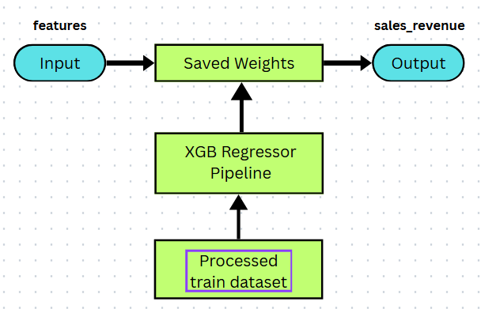
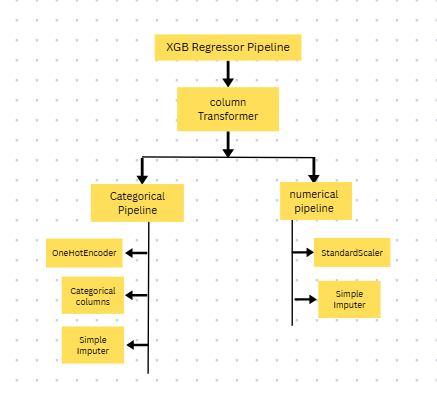

# *Revenue Sales Prediction*

- This Project uses Machine Learning concept to predict the `Sales Revenue` of the fictional E-commerce Company.
- Various regression Algorithms used to minimized the `rmse` such as : 
1. *Linear Regression*
2. *Decision Tree*
3. *Support Vector Regressor*
4. *Random Forest*
5. *Xtreame Gradient Boosting*

---

[](https://www.python.org/)
[](https://github.com/Yashuu05/SalesRevenuePrediction/actions)
[](CONTRIBUTORS.md)

----

## 📋 Table of Contents

- [About](#about)
- [Features](#features)
- [Architecture](#architecture)
- [Installation](#installation)
- [Usage](#usage)
- [Dataset](#dataset)
- [Model Performance](#model-performance)
- [Project Structure](#project-structure)
- [Contributing](#contributing)
- [Citation](#citation)
- [Contact](#contact)

---

## About

### Problem Statement :
- To predict the Sales Revenue of the E-commerce company using machine learning algorithms using `python`, `scikit-learn` and related libraries to
achieve minimum error. E-commerce companies spend $X and has diverse expenditure which makes difficult to forcast the revenue with minimum error and adjust the expenditure to achieve targated revenue.
- This project solves the problem of E-commerce companies by using machine learning concepts to predict the sales Revenue with minimum error possible to make it to realistic numbers and ease of use by implementing frontend and database.
- *Goal* : To achieve smallest possible error
- *Input* : `X_train.csv`
- *Output* : `sales_revenue`
- *Evaluation metric* : `Root Mean Squared Error (RMSE)`

---

## 🏗️ Architecture

### System Architecture



---

### Model architecture



---

## 📦 Installation

### Prerequisites

- Python 3.9 or higher (3.10 recommended)
- pip or conda package manager
- `Note`: _review `requirements.txt` for necessary dependencies_

### Steps

1. **Clone the repository**
   ```bash
   git clone https://github.com/Yashuu05/SalesRevenuePrediction.git
   cd SalesRevenuePrediction
   ```

2. **Create a virtual environment**
   ```bash
   python -m venv venv
   source venv/bin/activate  # On Windows: venv\Scripts\activate
   ```

3. **Install dependencies**
   ```bash
   pip install -r requirements.txt
   ```

4. **Download datasets**
- Dataset Source : https://www.kaggle.com/datasets/amineipad/e-commerce-marketing-and-sales-revenue-prediction

---

## 📊 Dataset

### Dataset Information

| Attribute | Details |
|-----------|---------|
| **Source** | https://www.kaggle.com/datasets/amineipad/e-commerce-marketing-and-sales-revenue-prediction |
| **Size** | 3.48 MB |
| **Records** | 18000 |
| **Features** | 17 |
| **Targets** | 1 |
| **Train/Test Split** | 0.20 |

---

### Data Description

- This dataset provides a comprehensive look into the marketing and advertising efforts of a digital retailer during the 2010–2011 period. It contains 18,000 training records detailing various advertising campaigns across multiple regions and channels. The primary objective of this dataset is to build a predictive model capable of forecasting sales_revenue (the target variable) for the provided test set, making it an excellent resource for practicing regression tasks, conducting exploratory data analysis on marketing ROI, and evaluating channel effectiveness.


## 📈 Model Performance

### Results Summary

| Model | RMSE 
|-------|----------|
| Linear Regression | 43.275869264410765 |
| SVR |  44.833731978502705    | 
| Decision Tree | 28.297191300512512 |
| RandomForest  | 24.569135458383673 |
| XGB Regressor | 11.331519281920807 |

---

## 📁 Project Structure

```
SalesRevenuePrediction/
│
|___  assets/   # images
|
├── README.md                 # Project documentation
├── requirements.txt          # Python dependencies
│
├── data/
│   ├── raw/                 # Original, immutable data
│   ├── processed/           # Cleaned, processed data
│   └── cleaned/             # cleaned data 
|   |__ predicted/           # predicted data on test dataset
│
├── models/
│   ├── xgb.pkl/      # Saved model weights
│
├── src/
|   |___ components/
|    |        |____   __init__.py
|    |        |____  CleanTestData.py
|    |        |____  CleanTrainData.py
|    |        |____  DataOverview.py
|    |        |____  FeatureEngineering.py
|    |        |____  Predict.py
|    |        |____  SaveModel.py
|    |        |____  SplitData.py
|    |        |____  train.py
|    |____ pipelines/
|            |___  __init__.py
|            |___  ModelPipeline.py
|            |___  Pipeline.py
│
|___  static/
|       |
|       |___  style.css
|
|___  templates/
|        |___  index.html
|        |___  dashboard.html
|
│__ utils\  
│      |
│      |___  __init__.py 
|      |___  DataClean.py
|      |___  DataExplore.py
|      |___  Data Split.py
|      |___  FeatureEngineering.py
|      |___  load_data.py
│
├── results/
│   ├── model_performance.csv/         # Model performance metrics
|
|___ .gitignore
|___  app.py
```
---

## 🤝 Contributing

We welcome contributions! Please follow these steps:

1. **Fork the repository**
   ```bash
   git clone https://github.com/Yashuu05/SalesRevenuePrediction.git
   ```

2. **Create a feature branch**
   ```bash
   git checkout -b feature/[FEATURE_NAME]
   ```

3. **Make your changes and commit**
   ```bash
   git add .
   git commit -m "Add [FEATURE_NAME]"
   ```

4. **Push to your branch**
   ```bash
   git push origin feature/[FEATURE_NAME]
   ```

5. **Submit a Pull Request**

### Coding Standards

- Follow PEP 8 style guide
- Add docstrings to all functions
- Write unit tests for new features
- Update documentation as needed

### Running Tests

```bash
# Run all tests
pytest

# Run with coverage
pytest --cov=src tests/

# Run specific test file
pytest tests/test_models.py -v
```

---

## 📚 Citation

If you use this project in your research, please cite it as:

```bibtex
@software{[YEAR],
  author = {[AUTHOR_NAME]},
  title = {[PROJECT_TITLE]},
  url = {https://github.com/[USERNAME]/[REPO_NAME]},
  year = {[YEAR]},
  note = {[VERSION_OR_DOI]}
}
```

Or in APA format:

```
[AUTHOR_NAME]. ([YEAR]). [PROJECT_TITLE]. Retrieved from https://github.com/[USERNAME]/[REPO_NAME]
```

---

## 📞 Contact

- **Author**: Yash Chillal
- **Email**: chillalyash2005@gmail.com
- **GitHub**: [@Yashuu05](https://github.com/Yashuu05)
- **Project Repository**: [https://github.com/Yashuu05/SalesRevenuePrediction](https://github.com/Yashuu05/SalesRevenuePrediction)

### Feedback & Issues

- 🐛 **Report Bugs**: [GitHub Issues](https://github.com/Yashu005/SalesRevenuePrediction/issues)
- 💡 **Suggest Features**: [Discussions](https://github.com/Yashuu05/SalesRevenuePrediction/discussions)
- ❓ **Ask Questions**: [GitHub Discussions](https://github.com/Yashuu05/SalesRevenuePrediction/discussions)

---

## 📖 Additional Resources
- dataset : https://www.kaggle.com/datasets/amineipad/e-commerce-marketing-and-sales-revenue-prediction?select=train.csv
- Scikit-learn : https://scikit-learn.org/stable/user_guide.html
- Kaggle : https://kaggle.com/

---

**Last Updated**: 30th March 2026

**Status**: ACTIVE
